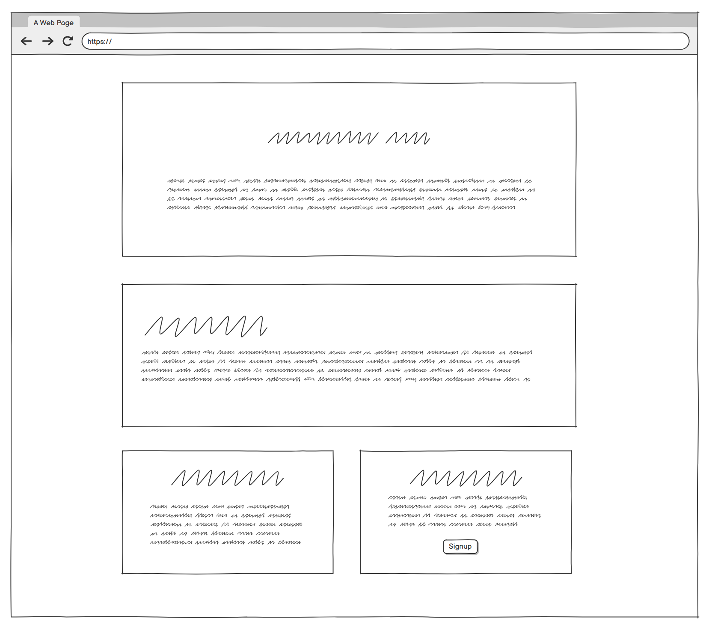
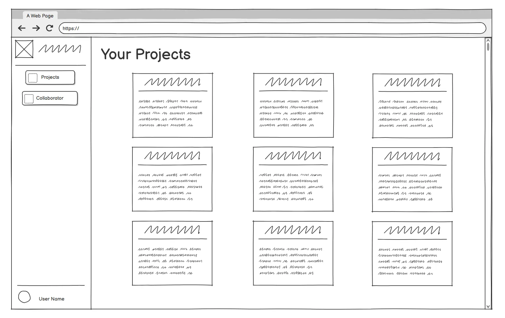
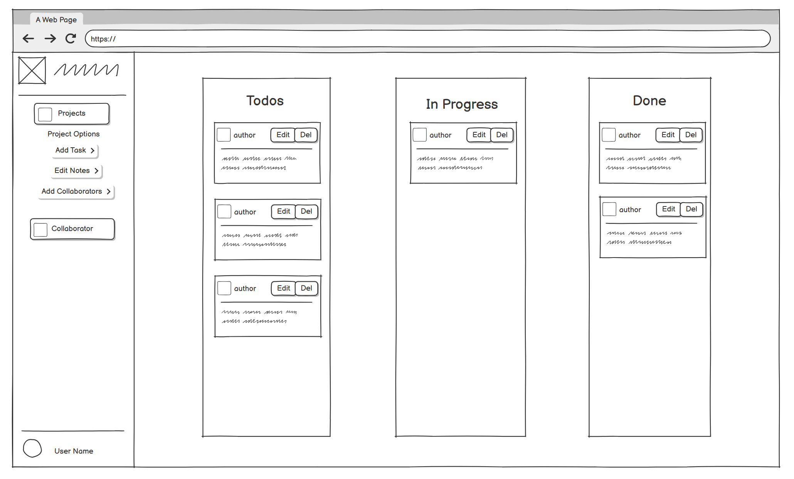
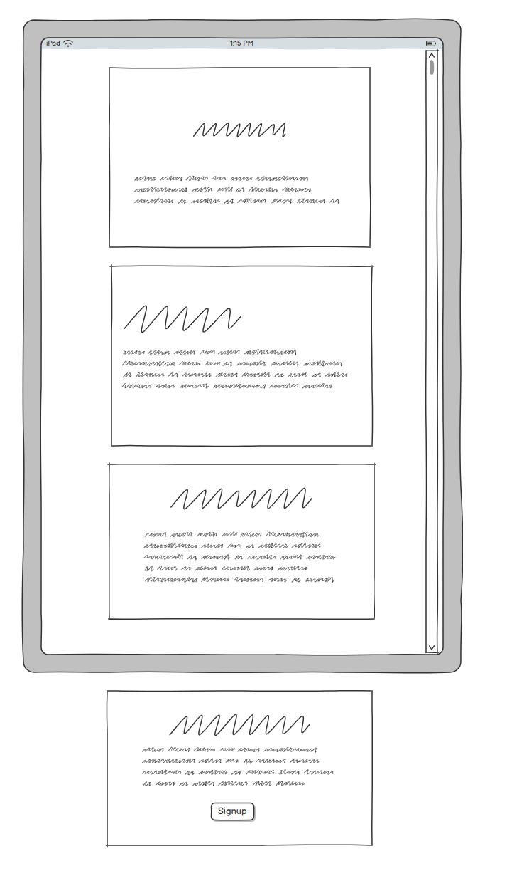
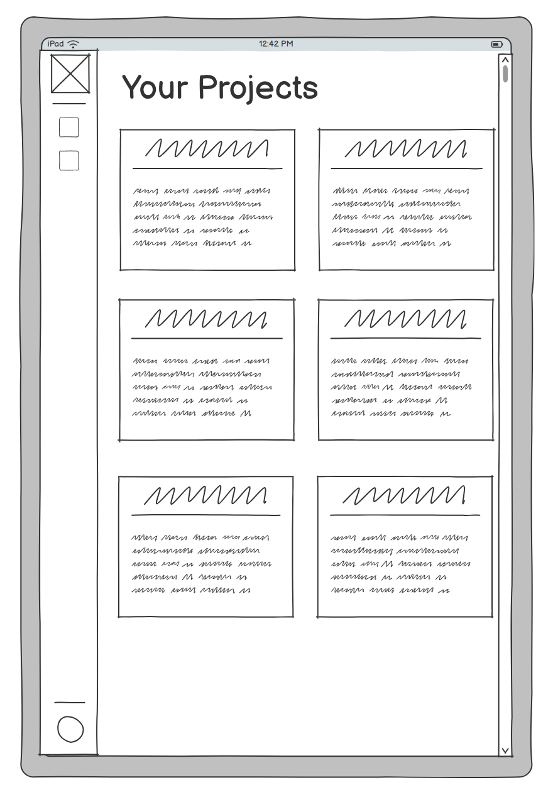
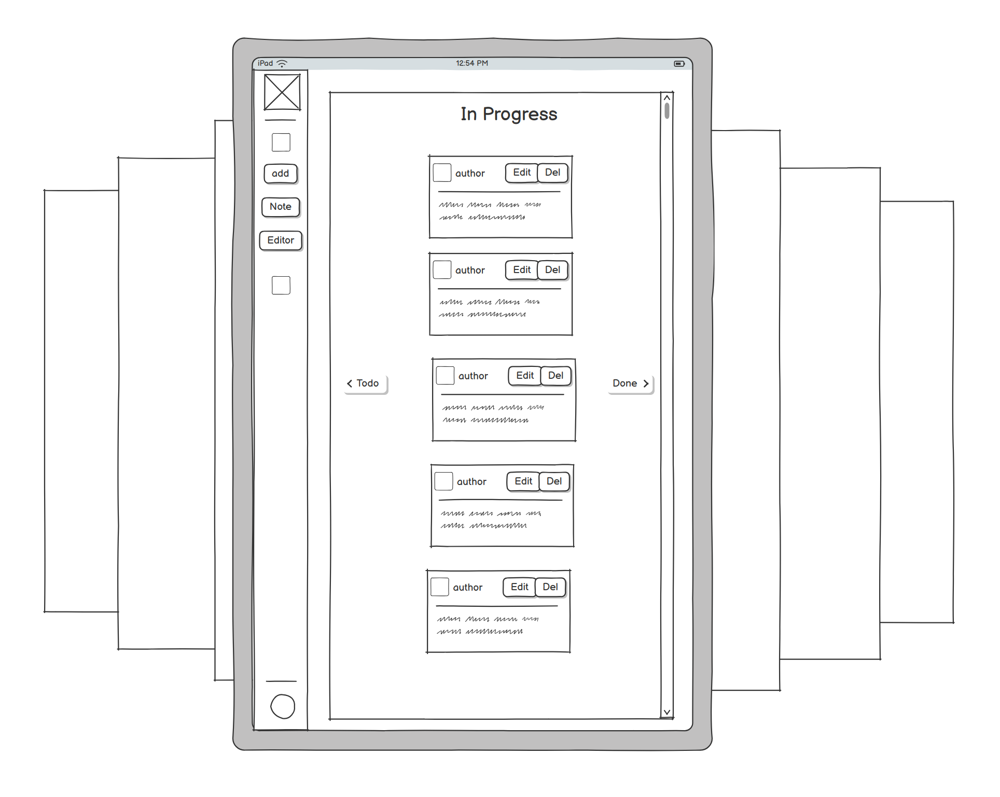

# Project Overview

Insert responsive image:

## Live Site:
link to live project

## Purpose Statement:
What is Boards?
Boards is a project tracker, very similar to the project boards found on GitHub. It is designed to allow individuals, and groups, keep track of projects they might have in a manner that makes progress easilly visual. 
Essentially, this is a web app designed with the Agile methodology in mind. As such it will aid in any work that is already suited, or could be adapted to suit the requirements of Agile.

Target Audience/Demographic

Who is this app/project for?

It will cater to many different groups, individuals, and teams, across fields. Though its benefits will primarily be seen by those who have to most need to keep track of their tasks within a team or general life. Demographics likely to benefit at face value are...

- Students:
    - individually they will be able to keep track of their work
    - groups can keep track of a group project meaning that everyone is up to date no matter what
- Coders/Software Engineers:
    - similarly to GitHub, this project tracker will provide a similar functionality to the project boards found on GitHub
    - Agile development teams, that could keep track of a project with multiple editors
- Businesses:
    - businesses that have a strong culture of planning and making tasks visible
    - large teams of people that need to be aware of how a project is coming along

Unique Selling Points

1. Simplified Agile Project Tracking:
    Boards will provide a user-friendly interface that enables users to effortlessly track projects, tasks, and progress.
Unlike complex tools like GitHub Projects, Boards will focus on simplicity and ease-of-use without sacrificing essential functionality.

2. Task Management for Individuals and Teams:
    Boards will cater to individuals such as students managing multiple projects or Agile development teams with numerous tasks.
Users will be able to create, edit, assign, and prioritize tasks seamlessly, ensuring everyone remains aligned and progress is visible.

3. Progress Visualization:
    With Boards' intuitive task board layout, users will be able to instantly see the status of each task.
Tasks can be updated between columns (e.g., To Do, In Progress, Done), providing an immediate understanding of project progress.

4. Cross-Platform Accessibility:
    Boards will be designed to be responsive and accessible on various devices and screen sizes.
Whether users are working from their laptop, tablet, or mobile phone, Boards ensures they can stay on top of tasks anytime, anywhere.

## Table of Contents:
Insert table of contents for easy navigation of readme.
- [Project Overview](#project-overview)
- [Development Path](#development-path)
    - [Strategy](#strategy)
        - [Plan](#plan)
        - [Scope](#scope)
        - [Structure](#structure)
        - [Skeleton](#skeleton)
        - [Surface](#surface)
    - [Project Features](#project-features)
        - [Current Features](#current-features)
        - [Future Features](#future-features)
    - [Methodologies](#methodologies)
        - [Version Control](#version-control)
        - [Agile Methodology](#agile-methodology)
        - [Frameworks](#languages--frameworks-utilised)
    - [Testing & Validation](#testing--validation)
        - [Bugs](#bugs)
        - [Manual Tests](#manual-tests)
        - [Validation](#validation)
    - [Deployment](#deployment)
        - [Steps to Deploy](#steps-to-deploy)
    - [Reflection](#reflection)
        - [Achievements](#achievements)
        - [Critical Analysis](#critical-analysis)
    - [Final Thoughts](#final-thoughts)

# Development Path:

## Strategy

### Design
The strategy behind this app was to utilise the Agile Methodologies learnt, and work towards a User Centered Design.

#### User Stories: Must Haves

User Story: Register Account

**User Story:** As a **User** I would like to be able to **Create an Account** so that I can **Access My Work Spaces Securely.**

Acceptance Criteria:
1. User can register account
    - [ ] allauth is installed as dependancy
    - [ ] can access registration page
    - [ ] can use form
    - [ ] can submit form
2. User is able to login
    - [ ] using submitted account creation details
    - [ ] login form works
3. User is able to see created Project Boards
    - [ ] user is displayed a list of their created projects

User Story: Create Data

**User Story:** As a **User** I would like to be able to **Create a Project and Tasks** so that I can **Keep Track of Ongoing Tasks and their Progress**.

Acceptance Criteria:
1. User is able to create new tasks by pressing add task button.
    - [ ] Add task button populates relevant kanban section
2. User is able to create project board by clicking the new project button.
    - [ ] New Project... button allows user to fill out form to create new project

User Story: Read Data

**User Story:** As a **User** I would like to be able to **See the Tasks I have Completed in a Project** so that I can **Track my Progress.**

Acceptance Criteria:
1. User is able to see a list of all their projects.
    - [ ] list of owned projects
2. User is able to select a project that they want to see.
    - [ ] projects linked to each relevant instance of project model
3. User is able to see information containerd within the relevant project.
    - [ ] templates load object of project model into view
4. Project board has a list of tasks sorted by their status.
    - [ ] user is able to read the title of the tasks
    - [ ] user is able to open task and read additional info

User Story: Update Data

**User Story:** As a **User** I would like to be able to **Update the Information on my Project Board** so that I can **Add and Remove Tasks, and Notes Based on Relevance.**

Acceptance Criteria:
1. User is able to open a project and add tasks to it.
    - [ ] tasks can be added to project
    - [ ] tasks are saved to the project
2. User is able to remove tasks from an opened project.
    - [ ] tasks can be removed from project
3. User is able to alter contents of task.
    - [ ] state of tasks is saved
4. Upon returning to the project, the users changes are present.
    - [ ] user is able to retrieve their project from the state in which they left it

User Story: Delete Data

**User Story:** As a **User** I would like to be able to **Delete my Tasks and their Data** so that I can **Keep my Tasks List Short and Current.**

Acceptance Criteria:
1. User is able to delete a task from the board.
    - [ ] user is able to click delete button on relevant task and delete it from board and model
2. User is asked to confirm their choice and give a warning.
    - [ ] user is asked to confirm their choice via modal before data is deleted
3. Users data is deleted, and user is sent back to list of tasks which will no longer contain the deleted item.
    - [ ] task is deleted from the tasks on the projects Kanban board.

User Story: Responsive Design

**User Story:** As a **User** I would like to be able to **User the App on Multiple Devices of Differeing Sizes** so that I am able to **User it on the go and at Home/Work.**

Acceptance Criteria:
1. Web app uses Bootstrap or Media Queries to adapt to multiple screen sizes.
    - [ ] bootstrap, media queries, and JavaScript with cookies
2. App is usable on small screens.
    - [ ] functional on small displays
3. App is usable on medium displays.
    - [ ] function on medium displays
4. App is usable on laptop/desktop displays.
    - [ ] functional on large displays

## Scope

Features:
- User registration, login, and role-based access (user/admin)
- Dashboard with am index of projects
- Project board with kanban board of tasks
- Project creation and management (title, description, date created)
- Task creation, editing, and deletion within projects
    - Task types: To Do, In Progress, Completed
    - Task content: for additional information
    - Task author: to see creator of task
- Real-time notifications for task updates and changes
- Responsive design for accessibility on various devices

Technologies:
- Back-end: Django (Python)
- Front-end: HTML5, CSS3 (Bootstrap), JavaScript
- Database: PostgreSQL with Django ORM
- Version Control: Git and GitHub
- Deployment: Heroku

## Structure

Logic Overview

- Greeting page for user to register or login.
- A dashboard that allows the user to easily navigate all features of the site.
- Navbar always stuck to left side of screen to keep uniformity, and provide more height.
- Project index with project cards displaying the title, description, and date. All with an "open project" button.
- Project view of kanban board for task organisation. Clear columns for Todo, In Progress, and Done.
- Tasks can be updated and deleted by pressing visible buttons on task.
- Users can see the tasks associated to the selected project and plan accordingly.

Site Map

New Users
1. Greeting page
2. Registration / SignUp page
3. Navbar not present until user is authorised
4. Projects Dashboard
5. Projects Kanban view

Registered Users
1. Project Index Dashboard
2. Projects Kanban View
3. Navbar present at all times
4. Form Modals
5. Toast Notifications

## Skeleton

Desktop Wireframes

Initial idea for the greeting page is to use bootstrap cards and jumbotrons to achive a nice aesthetic that guides the user to the sign up button.

The Projects Index page is set up in columns, though the actual ammount of columns is something that will be made responsive to device width.
Each Project will be openable. In case of too many projects on the page at once, an overflow on the y axis will be set to scroll.

The Task view will be setup similarly to the kanban board on GitHub. This means that users are able to have tasks in their desired column, and provides a quick overview of the progress made towards the overall project.

Tablet Wireframes

</img>

## Surface

## Project Features:
subtitle each section and provide images.
## Current Features

## Future Features

# Methodologies:

## Version Control

## Agile Methodology

## Languages & Frameworks Utilised

# Testing & Validation

## Bugs

## Manual Tests

## Validation

# Deployment

## Steps to Deploy

# Reflection

## Achievements

## Critical Analysis

# Final Thoughts

## Areas to Improve

# References/Attributions

